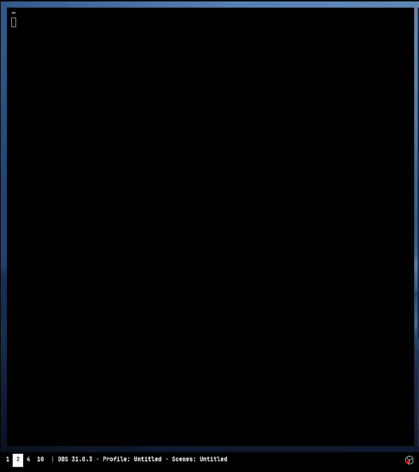

<h1 align="center">Tunnel</h1>

	
    

## REFLECTION POINT #1
### This is what the project can do as of now and I'll be adding more soon
---
    A modern CLI + TUI peer-to-peer file sharing tool (WIP)
  \
Tunnel is a command-line peer-to-peer file sharing tool, written in Rust. Quickly share files between devices on the same network (WiFi). Optional QR code-based HTTP sharing for computer -> <strong>MOBILE</strong> device sharing. 

## Features
-   *UDP-based peer discovery* — find devices on the same Wi-Fi automatically.
-   *Multi-file support* — send single files or multiple files (automatically zipped).
-   *File sending & receiving* — transfer files over TCP directly between devices.
-   *QR code download* — serve files over HTTP so mobile devices can scan & download easily.
-   *Interactive peer selection UI* — select target devices using a terminal menu (with `j/k` or arrows).

## Installation
	git clone git@github.com:muxx3/tunnel.git
	cd tunnel
	cargo build --release
    sudo mv target/release/tunnel /usr/local/bin/tunnel
        -   Makes 'tunnel' globally executable

 

<a href="https://www.youtube.com/shorts/v4RYwT8bcp4">Watch Demo here (1 min)</a>
 

  

## Usage

### Start receiver on target device
	tunnel recv
		-   Starts listening for incoming files on TCP port 8080.
		-   Also starts a UDP responder to reply to local peer discovery.

---

### Discover peers / Interactive mode (recommended)
	tunnel dig
	
		-   Broadcasts `DISCOVER` message on your local network (UDP).
		-   Lists available peers that are running `recv`.
		-   Use `j/k` or arrow keys to select an IP.    
		-   Press `Enter`, then you'll be prompted for file path(s).  
		-   Single files are sent with 'tunnel-' prefix.
		-   Multiple files are automatically zipped into 'tunnel.zip'.

---

### Send files (command line)
	tunnel send --file <path> --target-ip <ip-address>
	tunnel send --file <path1> <path2> <path3> --target-ip <ip-address>

 		-	Receiver must be running 'tunnel recv' to be seen
   
		-	Sends file(s) to given IP on TCP port 8080.
		-	Single file: sent with 'tunnel-' prefix
		-	Multiple files: automatically zipped into 'tunnel.zip'

---

### Send to mobile (QR code)
	tunnel serve --file <path>
	tunnel serve --file <path1> <path2> <path3>
	
		-   Generates a QR code in your terminal
		-   Single file: served with 'tunnel-' prefix
		-   Multiple files: automatically zipped into 'tunnel.zip'
		-   Scan it with your phone to download the file(s) over HTTP.

## File structure
	tunnel/
	├── Cargo.toml
	├── src/
	│   ├── commands/
	│   │   ├── dig.rs
	│   │   ├── recv.rs
	│   │   ├── send.rs
	│   │   └── serve.rs
	│   ├── network/
	│   │   ├── discovery.rs
 	│   │   ├── zip_helper.rs (I will move to utils in later update)
	│   │   └── tcp.rs
	│   ├── utils/
	│   │   └── file.rs
	│   ├── errors.rs
	│   └── main.rs

## How it works
-   **Discovery (UDP):** Broadcast "DISCOVER" message and collect "TUNNEL_HERE" replies.
-   **File transfer (TCP):** Sender connects to receiver's TCP port and streams file(s).
-   **Multi-file handling:** Single files get 'tunnel-' prefix; multiple files are zipped into 'tunnel.zip'.
-   **HTTP + QR code:** If sending to mobile, serve file(s) over HTTP with a QR code link.

## TODO
 - [ ] Add encryption support.
 - [ ] Add file integrity checks (e.g., hashes).
 - [ ] Improve progress reporting.
 - [ ] Allow customizable ports and config.
 - [x] Add native commands to use 'tunnel' instead of 'cargo'
 - [x] Add multi-file support with automatic zipping
 
 ## Disclaimer
This is a learning and demonstration project. Use at your own risk.

----------

## Contributing
PRs and feedback welcome! Check out the [issues](https://github.com/muxx3/tunnel/issues) tab to get started.

----------

## License
MIT License. See [LICENSE](LICENSE) for details.

----------

## Credits
Made with 🦀 (Rust) by [muxx3](https://github.com/muxx3).

